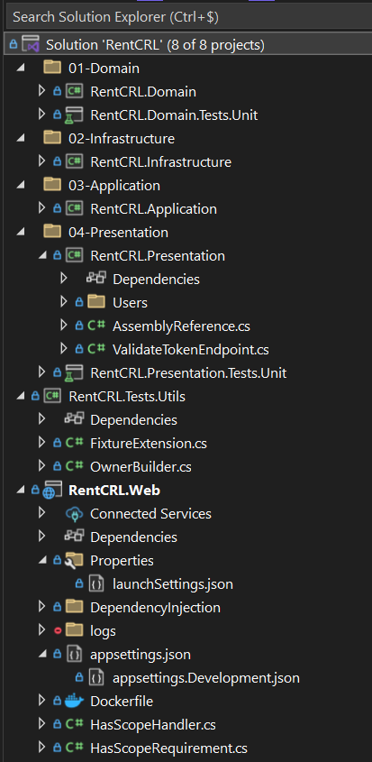

# RentCRL – entre Domain Driven Design et minimal API

Suite du développement de RentCRL : l’application qui permet aux propriétaires d’envoyer automatiquement les quittances de loyer à leurs locataires. Après avoir travaillé sur le frontend en React et l’intégration d’Auth0 pour l’authentification, je me suis attaqué au backend. Je vous partage ici mes choix techniques et leur motivation.

Pour faire simple, nous parlerons de clean architecture, DDD, minimal API, du pattern Result et de FluentValidation.

<!-- truncate -->

### Pourquoi Clean Architecture et Domain Driven Design ?

J’ai choisi de structurer mon backend en suivant les principes de la **Clean Architecture** et du **Domain Driven Design** car ceux-ci sont populaires dans l’industrie et j’avais tout simplement envie de me les approprier et de les découvrir.

Ce n’est pas forcément simple au début, mais ça force à bien séparer les responsabilités :

- le domaine contient la logique métier
- l’application s’occupe de l’orchestration
- l’infrastructure gère l’accès aux données
- la présentation reçoit les requêtes

Voici l’arborescence de la solution :



### Pourquoi j’ai utilisé Minimal API ?

Alors j’ai choisi d’utiliser Minimal API car pendant longtemps il fallait utiliser des contrôleurs mais depuis environ 2 ans .Net a sorti minimal API donc je me suis intéressé a ce que c’est.

De plus, je suis tombé sur une vidéo de Nick Chapsas qui compare minimal API avec MVC à travers une discussion sur le sujet et ce que j’en retiens est que minimal API est plus rapide, plus moderne avec moins de boilerplate et donc ça m’a encouragé dans mon envie de partir dessus.

[https://www.youtube.com/watch?v=bpVN_plQm5E](https://www.youtube.com/watch?v=bpVN_plQm5E)

### Pourquoi j'utilise Result&lt;T&gt; au lieu d’Exceptions ?

J’ai récemment regardé la vidéo de Milan Jovanovic qui introduit le pattern Result :

[https://www.youtube.com/watch?v=WCCkEe_Hy2Y&t=612s](https://www.youtube.com/watch?v=WCCkEe_Hy2Y&t=612s)

Il explique que les exceptions peuvent être coûteuses en performance. Alors, il propose un pattern intéressant pour gérer les erreurs “attendues” comme par exemple les erreurs de validation.

Et ainsi, on envoie des exceptions que pour les erreurs qui théoriquement ne devraient jamais arriver comment par exemple au moment de la création d’un Owner avec un paramètre non valide.
Erreur attendue :

```csharp

public async Task<Result<Owner>> CreateOwnerAsync(string auth0Id, string firstName, string lastName, string email, string phoneNumber)
{
    var response = _ownerRepository.GetByEmailAsync(email);
    if (response.Result != null)
        return Result.Failure<Owner>(UserErrors.EmailAlreadyExists);

    var newOwner = new Owner(auth0Id, firstName, lastName, email, phoneNumber);
    return await _ownerRepository.AddAsync(newOwner);
}
```

Erreur qui ne devrait pas se produire car on est déjà passé par toutes les couches précédentes (y compris la validation avec FluentValidation) :

```csharp
public Owner(string auth0Id, string firstName, string lastName, string email, string phoneNumber)
{
    if (string.IsNullOrEmpty(auth0Id))
        throw new ArgumentException("Auth0Id cannot be null.", nameof(auth0Id));

    if (string.IsNullOrEmpty(firstName))
        throw new ArgumentException("Firstname cannot be null.", nameof(firstName));

    if (string.IsNullOrEmpty(lastName))
        throw new ArgumentException("LastName cannot be null.", nameof(lastName));

    if (!Regexes.Email.IsMatch(email))
        throw new ArgumentException("Email is not valid.", nameof(email));

    if (!Regexes.PhoneNumber.IsMatch(phoneNumber))
        throw new ArgumentException("PhoneNumber is not valid.", nameof(phoneNumber));

    Id = Guid.NewGuid();
    Auth0Id = auth0Id;
    FirstName = firstName;
    LastName = lastName;
    Email = email;
    PhoneNumber = phoneNumber;
}
```

### Et FluentValidation dans tout ça ?

Je valide les entrées utilisateur dès la couche d’exposition, avec **FluentValidation**. C’est simple à brancher, puissant, et me permet de retourner des erreurs claires côté frontend sans mêler la validation à la logique métier. La couche domaine reste concentrée sur les règles métier, pendant que la validation des entrées est gérée directement dans la couche de présentation. Ça m'évite d’avoir des if/else ou des exceptions partout, et je peux centraliser les règles de validation dans des classes dédiées.

J’ai découvert FluentValidation grâce à mon frère, mais aussi via cette vidéo de Milan Jovanovic qui en fait une bonne démo :

[https://www.youtube.com/watch?v=vaDDB7BpEgQ](https://www.youtube.com/watch?v=vaDDB7BpEgQ)

C’est ce qui m’a convaincu de l’adopter ici.

```csharp
public class OwnerModelValidator : AbstractValidator<OwnerModel>
{
    public OwnerModelValidator()
    {
        RuleFor(o => o.Auth0Id).NotEmpty();
        RuleFor(o => o.FirstName).NotEmpty();
        RuleFor(o => o.LastName).NotEmpty();
        RuleFor(o => o.Email).NotEmpty().Matches(Regexes.Email);
        RuleFor(o => o.PhoneNumber).NotEmpty().Matches(Regexes.PhoneNumber);
    }
}
```

```csharp
public static class OwnerEndpoint
{
    public const string PostOwnerRoute = "/owners";

    public static void MapOwnerEndpoint(this IEndpointRouteBuilder app)
    {
        app.MapPost(PostOwnerRoute, CreateOwner)
        .RequireAuthorization()
        .WithName("Owners");
    }

    internal static async Task<IResult> CreateOwner([FromBody] OwnerModel ownerModel, IOwnerService ownerService, IValidator<OwnerModel> validator)
    {
        var validationResult = validator.Validate(ownerModel);
        if (!validationResult.IsValid)
            return Results.ValidationProblem(validationResult.ToDictionary());

        var result = await ownerService.CreateOwnerAsync(
            ownerModel.Auth0Id,
            ownerModel.FirstName,
            ownerModel.LastName,
            ownerModel.Email,
            ownerModel.PhoneNumber
        );

        if (result.IsSuccess)
        {
            var newOwner = result.Value.ToModel();
            return Results.Ok(newOwner);
        }

        if (result.Error == UserErrors.EmailAlreadyExists)
            return Results.Conflict();

        return Results.Problem(statusCode: StatusCodes.Status500InternalServerError);
    }
}
```

### Le résultat ?

Au final, je pense avoir un backend propre. C’est-à-dire testable et facile à maintenir pour ajouter les autres fonctionnalités par la suite et prêt à être déployé sur Azure. En tout cas, cela reste mon point de vue de développeur avec 2 ans d’expérience.

📁 Code source ici : [github.com/MickaelCRL/RentCRL](https://github.com/MickaelCRL/RentCRL)
